## Özet

Bu teknik rapor, Samsun ilinde yer alan Engiz Çayı Havzası'nın iklim değişikliği senaryoları altındaki kuraklık dinamiklerini incelemektedir. NASA NEX-GDDP-CMIP6 MPI-ESM1-2-HR modeli verileri kullanılarak havzanın 2100 yılına kadar olan Standartlaştırılmış Yağış Evapotranspirasyon İndeksi (SPEI-3) değerleri modellenmiştir. İstatistiksel analizler, otokorelasyon düzeltmeli Modifiye Mann-Kendall ve su yılı bazlı Pettitt testleri ile gerçekleştirilmiştir. Bulgular, özellikle SSP5-8.5 yüksek emisyon senaryosu altında havzanın **2052 su yılında** kalıcı ve şiddetli bir kurak rejim kayması (regime shift) yaşayacağını göstermektedir. Kuraklığın temel sürücüsü yağış azalmasından ziyade, ekstrem sıcaklık artışlarına bağlı olarak kontrolden çıkan atmosferik buharlaşma talebi (termodinamik zorlama) olduğunu göstermektedir.

## 1. Çalışma Alanı ve Coğrafi Sınırlar
Çalışma alanı, Samsun ilinin batısında konumlanan ve Karadeniz iklim kuşağının tipik bağıl nemli rejimine sahip olan **Engiz Çayı Havzası**'dır. Havzanın hidrolojik hassasiyeti, topoğrafik yapısının dik olması ve tarımsal faaliyetlerin büyük ölçüde düzenli yağış rejimine (rain-fed) bağımlı olmasından kaynaklanmaktadır.

### 1.1. Havza Sınırlarının Belirlenmesi
Havzanın topolojik sınırları ve nehir ağı (stream network), küresel ölçekte yüksek çözünürlüklü hidrolojik veriler sağlayan [MGHydro Watersheds](https://mghydro.com/watersheds/) platformundan temin edilmiştir. [İlgili havza raporuna göre](https://mghydro.com/app/report?lat=41.494&lng=36.118&precision=high&simplify=true), havza çıkış (outlet) noktası 41.494° K, 36.118° D koordinatlarında yer almakta olup, drenaj alanı iç kesimlere doğru genişlemektedir.


*Şekil 1: Engiz Çayı Havzası'nın konumu, hidrolojik ağı ve istatistiksel ölçek indirme (downscaling) uygulanmış NEX-GDDP-CMIP6 (~25 km) grid hücrelerinin kıyaslaması.*
### 1.2. Koordinat Aralıkları ve Grid Seçimi
Temin edilen shapefile kullanılarak yapılan coğrafi analiz sonucunda, havzanın sınırlarının yaklaşık olarak **41.30° - 41.50° Kuzey** enlemleri ve **35.80° - 36.20° Doğu** boylamları arasında yer aldığı belirlenmiştir. Bu sınırlar dahilinde, NEX-GDDP-CMIP6 veri setinden havza merkezini (Ortalama Enlem: 41.405° K) en iyi temsil eden 2 adet ~25 km (0.25°) çözünürlüklü grid hücresi analiz için filtrelenmiştir.

## 2. Veri Kaynakları ve Otomatize Ön İşleme (Pipeline)
Çalışmada, [NASA Ames Araştırma Merkezi](https://ds.nccs.nasa.gov/thredds/catalog/AMES/NEX/GDDP-CMIP6/MPI-ESM1-2-HR/catalog.html) tarafından sağlanan Bias-Corrected Spatial Disaggregation (BCSD) yöntemiyle istatistiksel olarak $\sim$25 km çözünürlüğe indirilmiş **NEX-GDDP-CMIP6** veri seti kullanılmıştır. 

Model olarak Max Planck Enstitüsü tarafından geliştirilen **MPI-ESM1-2-HR** seçilmiştir; bu model, yüksek çözünürlüğü sayesinde ekstratropikal siklonları ve orta enlem dinamiklerini başarılı bir şekilde simüle etmektedir. Analiz, Historical referans dönemi (1980-2014) ile dört farklı Paylaşılan Sosyoekonomik Rota (SSP1-2.6, SSP2-4.5, SSP3-7.0, SSP5-8.5) projeksiyonunu (2015-2100) kapsamaktadır.

### 2.1. Bash ve CDO ile Veri Çekimi

İndirme ve birim dönüşüm işlemleri asenkron paralel işçiler (worker) ve CDO (Climate Data Operators) kullanılarak otomatize edilmiştir.

**Birim Dönüşümleri ve İndirgeme Rasyoneli:**

* `pr` (Yağış): Orijinal birim kg/m²/s. Günlük toplama geçmek için 86400 ile çarpılmış (`mulc,86400`), ardından aylık toplamlara (`monsum`) dönüştürülmüştür.
* `tasmax` / `tasmin`: Orijinal birim Kelvin. Celsius'a dönüştürmek için 273.15 çıkarılmış (`subc,273.15`), ardından aylık ortalamalara (`monmean`) dönüştürülmüştür.

<details>
<summary><b>Otomatize Veri Çekme Bash Betiği (Genişletmek için tıklayın)</b></summary>

```bash
#!/bin/bash

export HDF5_USE_FILE_LOCKING=FALSE

# --- Ortam Değişkenleri ---
export NORTH=41.4
export SOUTH=41.3
export WEST=35.8
export EAST=36.2
export MODEL="MPI-ESM1-2-HR"
export VARIANT="r1i1p1f1"
export OUT_DIR="data"

VARIABLES=("pr" "tasmax" "tasmin")
SSPS=("ssp126" "ssp245" "ssp370" "ssp585")

mkdir -p "$OUT_DIR"

# Sinyal Yakalama: Betik durdurulursa temizlik yap
trap 'rm -f worker.sh download_tasks.txt; exit 1' INT TERM

# 1. İşçi (Worker) Betiği
cat << 'EOF' > worker.sh
#!/bin/bash
SCENARIO=$1
VAR=$2
YEAR=$3

BASE_URL="https://ds.nccs.nasa.gov/thredds/ncss/grid/AMES/NEX/GDDP-CMIP6/${MODEL}/${SCENARIO}/${VARIANT}"
FILE="${VAR}_day_${MODEL}_${SCENARIO}_${VARIANT}_gn_${YEAR}_v2.0.nc"
NCSS_URL="${BASE_URL}/${VAR}/${FILE}?var=${VAR}&north=${NORTH}&west=${WEST}&east=${EAST}&south=${SOUTH}&horizStride=&time_start=${YEAR}-01-01T12%3A00%3A00Z&time_end=${YEAR}-12-31T12%3A00%3A00Z&timeStride=&vertCoord=&accept=netcdf3&addLatLon=true"

RAW_SUBSET="$OUT_DIR/$VAR/subset_${SCENARIO}_${VAR}_${YEAR}.nc"
TEMP_UNIT="$OUT_DIR/$VAR/temp_unit_${SCENARIO}_${VAR}_${YEAR}.nc"
FINAL_MONTHLY="$OUT_DIR/$VAR/${VAR}_aylik_${SCENARIO}_${YEAR}.nc"

if [ -f "$FINAL_MONTHLY" ]; then
    exit 0
fi

wget -q -t 2 --user-agent="Mozilla/5.0 (X11; Linux x86_64)" --timeout=60 -O "$RAW_SUBSET" "$NCSS_URL"

if [ ! -s "$RAW_SUBSET" ] || grep -q "<html>" "$RAW_SUBSET" || grep -q "<Exception>" "$RAW_SUBSET"; then
    echo "[HATA] $VAR | $SCENARIO | $YEAR -> Sunucu reddetti veya dosya bozuk."
    rm -f "$RAW_SUBSET"
    exit 1
fi

# CDO işlemleri fiziksel adımlara bölündü (Sanal Pipe İptal)
if [ "$VAR" == "pr" ]; then
    cdo -s -O -f nc mulc,86400 "$RAW_SUBSET" "$TEMP_UNIT"
    cdo -s -O -f nc monsum "$TEMP_UNIT" "$FINAL_MONTHLY"
else
    cdo -s -O -f nc subc,273.15 "$RAW_SUBSET" "$TEMP_UNIT"
    cdo -s -O -f nc monmean "$TEMP_UNIT" "$FINAL_MONTHLY"
fi

# Geçici fiziksel dosyaları temizle
rm -f "$RAW_SUBSET" "$TEMP_UNIT"
echo "[Tamam] $VAR | $SCENARIO | $YEAR"
EOF

chmod +x worker.sh

# 2. Kuyruk Oluşturma
TASK_FILE="download_tasks.txt"
> "$TASK_FILE"

for VAR in "${VARIABLES[@]}"; do
    mkdir -p "$OUT_DIR/$VAR"
    for YEAR in $(seq 1980 2014); do
        echo "historical $VAR $YEAR" >> "$TASK_FILE"
    done
done

for SSP in "${SSPS[@]}"; do
    for VAR in "${VARIABLES[@]}"; do
        for YEAR in $(seq 2015 2100); do
            echo "$SSP $VAR $YEAR" >> "$TASK_FILE"
        done
    done
done

# 3. xargs ile Paralel Çalıştırma
echo "xargs ile 10 paralel indirme ve işleme başlatılıyor..."
xargs -P 10 -n 3 -a "$TASK_FILE" ./worker.sh

echo "Zaman serileri birleştiriliyor..."

# 4. Yılları Birleştirme
for VAR in "${VARIABLES[@]}"; do
    HIST_FILE="$OUT_DIR/${VAR}_engiz_historical_1980_2014.nc"
    cdo -s -O -f nc mergetime "$OUT_DIR/$VAR/${VAR}_aylik_historical_"*.nc "$HIST_FILE"

    for SSP in "${SSPS[@]}"; do
        SSP_FILE="$OUT_DIR/${VAR}_engiz_${SSP}_2015_2100.nc"
        FINAL_MERGED="$OUT_DIR/${VAR}_engiz_merged_${SSP}_1980_2100.nc"

        cdo -s -O -f nc mergetime "$OUT_DIR/$VAR/${VAR}_aylik_${SSP}_"*.nc "$SSP_FILE"

        if [ -f "$HIST_FILE" ] && [ -f "$SSP_FILE" ]; then
            cdo -s -O -f nc mergetime "$HIST_FILE" "$SSP_FILE" "$FINAL_MERGED"
            echo " -> Oluşturuldu: $FINAL_MERGED"
        fi
    done
    rm -rf "$OUT_DIR/$VAR"
done

rm -f worker.sh "$TASK_FILE"
echo "Tüm boru hattı başarıyla tamamlandı."
```

</details>

## 3\. Metodoloji ve Python Entegrasyonu

### 3.1. SPEI-3 Modellemesi ve Thornthwaite Yaklaşımı
Kuraklık analizi için yalnızca yağışı dikkate alan SPI yerine, küresel ısınmanın havza üzerindeki termodinamik baskısını modelleyebilmek adına Standartlaştırılmış Yağış Evapotranspirasyon İndeksi (SPEI) tercih edilmiştir. Tarımsal stresi ve kısa vadeli nem eksikliğini ölçmek için indeks 3 aylık zaman ölçeğinde (SPEI-3) çalıştırılmıştır.

Potansiyel Evapotranspirasyon (PET) hesabı için Thornthwaite formülü kullanılmıştır. Metodolojik Sınırlama: Thornthwaite yöntemi radyasyon dengesini veya rüzgar hızını hesaba katmayıp yalnızca sıcaklığa dayandığı için, ekstrem emisyon senaryolarının yüzyıl sonu projeksiyonlarında buharlaşmayı olduğundan biraz daha şiddetli hesaplama (overestimation) eğilimine sahiptir.

### 3.2. Trend Analizi: Hamed & Rao Modifiye Mann-Kendall Testi
Hidroklimatolojik zaman serilerinde mevcut olan pozitif lag-1 otokorelasyon (serial correlation), standart Mann-Kendall testinin trendin varlığını abartmasına (Tip 1 hatası) neden olur. Bu istatistiksel yanılgıyı önlemek için, verinin varyansını otokorelasyon katsayısına göre düzelten **Hamed & Rao (1998)** modifikasyonu kullanılmıştır.

<details>
<summary><b>MK Trend Analizi Python Betiği (Genişletmek için tıklayın)</b></summary>

```python
import warnings

warnings.filterwarnings("ignore")

import os

# GDAL'ın C seviyesindeki konsol gürültülerini susturmak için:
os.environ["CPL_QUIET"] = "ON"
os.environ["CPL_LOG"] = "/dev/null"

import matplotlib.dates as mdates
import matplotlib.pyplot as plt
import numpy as np
import pandas as pd
import pymannkendall as mk
import xarray as xr
from climate_indices import compute, indices

# -------------------------------------------------
# GENEL AYARLAR
# -------------------------------------------------
OUT_DIR = "data"
os.makedirs(OUT_DIR, exist_ok=True)

BASIN_LAT = 41.405
SCENARIOS = ["ssp126", "ssp245", "ssp370", "ssp585"]

CALIB_START_YEAR = 1980
CALIB_END_YEAR = 2014
DATA_START_YEAR = 1980

ROLLING_WINDOW = 120  # 10 yıllık hareketli ortalama (ay cinsinden)

print("\nSPEI-3 Mann-Kendall Analizi Başlatıldı\n")


# -------------------------------------------------
# ANA DÖNGÜ
# -------------------------------------------------
for ssp in SCENARIOS:

    print(f"İşleniyor → {ssp.upper()}")

    # 1. VERİ OKUMA
    pr_file = f"{OUT_DIR}/pr_engiz_merged_{ssp}_1980_2100.nc"
    tasmax_file = f"{OUT_DIR}/tasmax_engiz_merged_{ssp}_1980_2100.nc"
    tasmin_file = f"{OUT_DIR}/tasmin_engiz_merged_{ssp}_1980_2100.nc"

    pr_ds = xr.open_dataset(pr_file, chunks={})
    tasmax_ds = xr.open_dataset(tasmax_file, chunks={})
    tasmin_ds = xr.open_dataset(tasmin_file, chunks={})

    # 2. GRID ORTALAMASI
    pr_ts = pr_ds.pr.mean(dim=["lat", "lon"]).load().values
    tasmax_ts = tasmax_ds.tasmax.mean(dim=["lat", "lon"]).load().values
    tasmin_ts = tasmin_ds.tasmin.mean(dim=["lat", "lon"]).load().values
    tasmean_ts = (tasmax_ts + tasmin_ts) / 2.0

    time_dt = pd.to_datetime(pr_ds.time.values)

    # 3. PET HESABI (Thornthwaite)
    pet_ts = indices.pet(
        temperature_celsius=tasmean_ts,
        latitude_degrees=BASIN_LAT,
        data_start_year=DATA_START_YEAR,
    )

    # 4. SPEI-3 HESABI
    spei3_ts = indices.spei(
        precips_mm=pr_ts,
        pet_mm=pet_ts,
        scale=3,
        distribution=indices.Distribution.pearson,
        periodicity=compute.Periodicity.monthly,
        data_start_year=DATA_START_YEAR,
        calibration_year_initial=CALIB_START_YEAR,
        calibration_year_final=CALIB_END_YEAR,
    )

    spei_series = pd.Series(spei3_ts, index=time_dt)

    # 5. TREND ANALİZİ (Mann-Kendall)
    valid_mask = ~np.isnan(spei3_ts)
    spei_clean = spei3_ts[valid_mask]

    if len(spei_clean) > 10:
        mk_result = mk.hamed_rao_modification_test(spei_clean)
        p_value = mk_result.p
        sen_slope_month = mk_result.slope
        sen_slope_decadal = sen_slope_month * 120
        intercept = mk_result.intercept

        x_clean = np.arange(len(spei_clean))
        trend_clean = (sen_slope_month * x_clean) + intercept

        trend_line = np.full(len(spei3_ts), np.nan)
        trend_line[valid_mask] = trend_clean

        trend_color = "black" if p_value < 0.05 else "gray"
        sig_label = (
            f"Anlamlı (p={p_value:.4f})"
            if p_value < 0.05
            else f"Anlamsız (p={p_value:.4f})"
        )
    else:
        trend_line = np.full(len(spei3_ts), np.nan)
        sen_slope_decadal = np.nan
        sig_label = "Veri yetersiz"
        trend_color = "gray"

    # 6. 10-YILLIK HAREKETLİ ORTALAMA
    rolling_trend = spei_series.rolling(
        window=ROLLING_WINDOW, center=True, min_periods=ROLLING_WINDOW
    ).mean()

    # 7. GÖRSELLEŞTİRME
    plt.figure(figsize=(16, 9))

    # Dönemsel Gölgelendirme (Arka Plan)
    ref_start = time_dt[0]
    ref_end = pd.to_datetime(f"{CALIB_END_YEAR}-12-31")
    plt.axvspan(ref_start, ref_end, color="gray", alpha=0.1, zorder=0)

    # Çubuk Grafik
    colors = np.where(spei3_ts < 0, "#c0392b", "#2980b9")
    plt.bar(
        time_dt,
        spei3_ts,
        width=25,
        color=colors,
        alpha=0.75,
        label="Aylık SPEI-3",
        zorder=3,
    )

    # Doğrusal Trend ve Hareketli Ortalama
    trend_legend = f"Sen Trend: {sen_slope_decadal:.3f} / 10 yıl | {sig_label}"
    plt.plot(
        time_dt,
        trend_line,
        linestyle="--",
        linewidth=3,
        color=trend_color,
        label=trend_legend,
        zorder=5,
    )
    plt.plot(
        time_dt,
        rolling_trend,
        color="purple",
        linewidth=2.5,
        label="10-Yıllık Dekadal Ortalama",
        zorder=4,
    )

    # Sıfır Çizgisi
    plt.axhline(0, color="black", linewidth=1.5, zorder=2)

    # Eşik Çizgileri
    threshold_styles = {
        2.0: ("darkgreen", "-.", "Ekstrem Nemli (+2.0)"),
        1.5: ("green", "--", "Şiddetli Nemli (+1.5)"),
        1.0: ("lightgreen", "--", "Orta Nemli (+1.0)"),
        -1.0: ("orange", "--", "Orta Kuraklık (-1.0)"),
        -1.5: ("red", "--", "Şiddetli Kuraklık (-1.5)"),
        -2.0: ("darkred", "-.", "Ekstrem Kuraklık (-2.0)"),
    }
    for th, (color, ls, label) in threshold_styles.items():
        plt.axhline(
            th,
            color=color,
            linestyle=ls,
            linewidth=1.2,
            alpha=0.7,
            label=label,
            zorder=2,
        )

    # Referans Dönemi Sınır Çizgisi ve Metinleri
    plt.axvline(
        ref_end, color="dimgray", linewidth=2.5, linestyle=":", zorder=5
    )

    # Bbox (kapsüllenmiş) metin ayarları
    bbox_props = dict(
        boxstyle="round,pad=0.3", fc="white", ec="gray", lw=0.5, alpha=0.85
    )

    plt.text(
        pd.to_datetime("1997-01-01"),
        -4.1,
        "Referans Dönemi\n(1980-2014)",
        color="dimgray",
        fontsize=11,
        ha="center",
        fontweight="bold",
        bbox=bbox_props,
        zorder=6,
    )
    plt.text(
        pd.to_datetime("2057-01-01"),
        -4.1,
        "Gelecek Projeksiyonu\n(2015-2100)",
        color="black",
        fontsize=11,
        ha="center",
        fontweight="bold",
        bbox=bbox_props,
        zorder=6,
    )

    # Başlık ve Eksenler
    # plt.title(
    #     f"Engiz Çayı Havzası SPEI-3 Trend Analizi | Senaryo: {ssp.upper()}",
    #     fontsize=16,
    #     fontweight="bold",
    #     pad=15,
    # )
    plt.xlabel("Yıllar", fontsize=12, fontweight="bold")
    plt.ylabel("SPEI-3 İndeks Değeri", fontsize=12, fontweight="bold")
    plt.ylim(-4.5, 4.5)

    ax = plt.gca()
    ax.xaxis.set_major_locator(mdates.YearLocator(10))
    ax.xaxis.set_major_formatter(mdates.DateFormatter("%Y"))

    # Lejant
    plt.legend(
        loc="upper center",
        bbox_to_anchor=(0.5, -0.1),
        ncol=3,
        fontsize=10,
        frameon=False,
    )

    plt.grid(axis="y", linestyle="--", alpha=0.4, zorder=1)
    plt.tight_layout()

    out_fig = f"{OUT_DIR}/SPEI3_MK_{ssp.upper()}.png"
    plt.savefig(out_fig, dpi=300, bbox_inches="tight")
    plt.close()

    print(f"  -> Kaydedildi: {out_fig}")

print("\nTüm analizler tamamlandı.\n")
```

</details>

### 3.3. Rejim Kayması: Su Yılı Bazlı Pettitt Kırılma Analizi
Klimatolojik veri setlerinde homojenliğin nerede bozulduğunu ve sistemin hangi yılda yeni bir denge durumuna geçtiğini (regime shift) saptamak için parametrik olmayan Pettitt (1979) testi uygulanmıştır.
Analiz takvim yılı (Ocak-Aralık) üzerinden yapılmamıştır; zira takvim yılı, kış yağışları birikimini ve bahar akışını ortadan bölerek hidrolojik hafızayı parçalar. Analiz, hidrolojik döngünün doğal kapanış evresini referans alan **Su Yılı** (1 Ekim - 30 Eylül) bazlı yıllıklara (resampling) indirgenerek yapılmıştır.

<details>
<summary><b>Pettitt Testi Python Betiği (Genişletmek için tıklayın)</b></summary>

```python
import warnings

warnings.filterwarnings("ignore")

import os

# GDAL'ın C seviyesindeki konsol gürültülerini susturmak için:
os.environ["CPL_QUIET"] = "ON"
os.environ["CPL_LOG"] = "/dev/null"

import matplotlib.dates as mdates
import matplotlib.pyplot as plt
import numpy as np
import pandas as pd
import pyhomogeneity as hg
import xarray as xr
from climate_indices import compute, indices

# -------------------------------------------------
# GENEL AYARLAR
# -------------------------------------------------
OUT_DIR = "data"
os.makedirs(OUT_DIR, exist_ok=True)

BASIN_LAT = 41.405
SCENARIOS = ["ssp126", "ssp245", "ssp370", "ssp585"]

CALIB_START_YEAR = 1980
CALIB_END_YEAR = 2014
DATA_START_YEAR = 1980

print("\nSu Yılı Bazlı Pettitt Kırılma Noktası Analizi Başlatıldı\n")

# -------------------------------------------------
# ANA DÖNGÜ
# -------------------------------------------------
for ssp in SCENARIOS:
    print(f"İşleniyor → {ssp.upper()}")

    # 1. VERİ OKUMA
    pr_file = f"{OUT_DIR}/pr_engiz_merged_{ssp}_1980_2100.nc"
    tasmax_file = f"{OUT_DIR}/tasmax_engiz_merged_{ssp}_1980_2100.nc"
    tasmin_file = f"{OUT_DIR}/tasmin_engiz_merged_{ssp}_1980_2100.nc"

    pr_ds = xr.open_dataset(pr_file, chunks={})
    tasmax_ds = xr.open_dataset(tasmax_file, chunks={})
    tasmin_ds = xr.open_dataset(tasmin_file, chunks={})

    # 2. GRID ORTALAMASI
    pr_ts = pr_ds.pr.mean(dim=["lat", "lon"]).load().values
    tasmax_ts = tasmax_ds.tasmax.mean(dim=["lat", "lon"]).load().values
    tasmin_ts = tasmin_ds.tasmin.mean(dim=["lat", "lon"]).load().values
    tasmean_ts = (tasmax_ts + tasmin_ts) / 2.0

    time_dt = pd.to_datetime(pr_ds.time.values)

    # 3. PET HESABI (Thornthwaite)
    pet_ts = indices.pet(
        temperature_celsius=tasmean_ts,
        latitude_degrees=BASIN_LAT,
        data_start_year=DATA_START_YEAR,
    )

    # 4. SPEI-3 HESABI
    spei3_ts = indices.spei(
        precips_mm=pr_ts,
        pet_mm=pet_ts,
        scale=3,
        distribution=indices.Distribution.pearson,
        periodicity=compute.Periodicity.monthly,
        data_start_year=DATA_START_YEAR,
        calibration_year_initial=CALIB_START_YEAR,
        calibration_year_final=CALIB_END_YEAR,
    )

    spei_series = pd.Series(spei3_ts, index=time_dt)

    # 5. SU YILI (WATER YEAR) DÖNÜŞÜMÜ
    spei_wy = spei_series.resample("AS-OCT").mean()
    spei_wy = spei_wy.dropna()

    # 6. PETTITT TESTİ
    pettitt_res = hg.pettitt_test(spei_wy.values)

    p_value = pettitt_res.p
    cp_index = pettitt_res.cp

    mu1, mu2 = pettitt_res.avg

    cp_date = spei_wy.index[cp_index]
    cp_year = cp_date.year + 1

    if p_value < 0.05:
        sig_label = f"Anlamlı Kırılma (p={p_value:.4f})"
        cp_color = "black"
        bg_alpha = 0.06
    else:
        sig_label = f"Anlamsız Kırılma (p={p_value:.4f})"
        cp_color = "gray"
        bg_alpha = 0.02

    step_x = spei_wy.index
    step_y = np.concatenate(
        [np.full(cp_index, mu1), np.full(len(spei_wy) - cp_index, mu2)]
    )

    # 7. GÖRSELLEŞTİRME
    plt.figure(figsize=(16, 9))

    # Arka Plan Gölgelendirmesi (Rejim Dönemleri)
    if p_value < 0.05:
        plt.axvspan(
            spei_wy.index[0],
            cp_date,
            color="green",
            alpha=bg_alpha,
            label="Rejim 1 (Bağıl Nemli Dönem)",
        )
        plt.axvspan(
            cp_date,
            spei_wy.index[-1],
            color="red",
            alpha=bg_alpha,
            label="Rejim 2 (Bağıl Kurak Dönem)",
        )

    # Çubuk Grafik
    colors = np.where(spei_wy.values < 0, "#c0392b", "#2980b9")
    plt.bar(
        spei_wy.index,
        spei_wy.values,
        width=250,
        color=colors,
        alpha=0.75,
        label="Su Yılı Ortalaması (SPEI-3)",
        zorder=3,
    )

    # Basamak Fonksiyonu
    step_legend = rf"Rejim Ortalamaları ($\mu_1$={mu1:.2f}, $\mu_2$={mu2:.2f})"
    plt.step(
        step_x,
        step_y,
        where="post",
        color=cp_color,
        linewidth=3.5,
        linestyle="-",
        label=step_legend,
        zorder=4,
    )

    # Kırılma Noktası Çizgisi
    if p_value < 0.05:
        plt.axvline(
            cp_date,
            color="purple",
            linewidth=2.5,
            linestyle="--",
            label=f"Kırılma Yılı: Su Yılı {cp_year} | {sig_label}",
            zorder=5,
        )

        # Ortalama Değerlerin Anotasyonu
        plt.text(
            spei_wy.index[cp_index // 2],
            mu1 + 0.15,
            rf"$\mu_1$ = {mu1:.2f}",
            color="black",
            fontsize=11,
            fontweight="bold",
            ha="center",
            bbox=dict(facecolor="white", alpha=0.7, edgecolor="none", pad=1.5),
        )
        plt.text(
            spei_wy.index[cp_index + (len(spei_wy) - cp_index) // 2],
            mu2 + 0.15,
            rf"$\mu_2$ = {mu2:.2f}",
            color="black",
            fontsize=11,
            fontweight="bold",
            ha="center",
            bbox=dict(facecolor="white", alpha=0.7, edgecolor="none", pad=1.5),
        )

    # Referans Dönemi Sınırı
    ref_end = pd.to_datetime(f"{CALIB_END_YEAR}-12-31")
    plt.axvline(ref_end, color="gray", linewidth=2, zorder=2)
    plt.text(
        pd.to_datetime("1997-01-01"),
        -3.2,
        "Referans Dönemi",
        color="gray",
        fontsize=11,
        ha="center",
        fontweight="bold",
    )
    plt.text(
        pd.to_datetime("2057-01-01"),
        -3.2,
        "Gelecek Projeksiyonu",
        color="black",
        fontsize=11,
        ha="center",
        fontweight="bold",
    )

    # Eşik Çizgileri (Simetrik)
    plt.axhline(0, color="black", linewidth=1.5, zorder=2)

    thresholds = {
        1.5: ("green", "--"),
        1.0: ("lightgreen", "--"),
        -1.0: ("orange", "--"),
        -1.5: ("red", "--"),
    }
    for th, (color, ls) in thresholds.items():
        plt.axhline(
            th, color=color, linestyle=ls, linewidth=1, alpha=0.7, zorder=2
        )

    # plt.title(
    #     f"Engiz Çayı Havzası Su Yılı Pettitt Kırılma Noktası Analizi | {ssp.upper()}",
    #     fontsize=16,
    #     fontweight="bold",
    #     pad=15,
    # )
    plt.xlabel("Su Yılları (Ekim - Eylül)", fontsize=12)
    plt.ylabel("Yıllık Ortalama SPEI-3 İndeks Değeri", fontsize=12)
    plt.ylim(-3.5, 3.5)

    ax = plt.gca()
    ax.xaxis.set_major_locator(mdates.YearLocator(10))
    ax.xaxis.set_major_formatter(mdates.DateFormatter("%Y"))

    # Lejant düzenlemesi
    plt.legend(
        loc="upper center",
        bbox_to_anchor=(0.5, -0.12),
        ncol=3,
        fontsize=10,
        frameon=False,
    )
    plt.grid(axis="y", linestyle="--", alpha=0.4, zorder=1)
    plt.tight_layout()

    out_fig = f"{OUT_DIR}/SPEI3_Pettitt_{ssp.upper()}.png"
    plt.savefig(out_fig, dpi=300, bbox_inches="tight")
    plt.close()

    print(
        f"  -> Kırılma Yılı: {cp_year} (p={p_value:.4f}) | Kaydedildi: {out_fig}"
    )

print("\nTüm Pettitt testleri tamamlandı.\n")
```

</details>

### 3.4. İklimsel Sürücüler Analizi

SPEI düşüşünün yağış eksikliğinden mi (dinamik) yoksa sıcaklıktan mı (termodinamik) kaynaklandığını izole etmek için, aylık klimatolojiler üzerinden Orta Gelecek (2041-2070) ve Uzak Gelecek (2071-2100) periyotları referans dönemiyle (1980-2014) kıyaslanmıştır.

## 4. Bulgular ve Tartışma

### 4.1. Kronik Kuraklaşma Eğilimi (MK Trendleri)

İstatistiksel analizler, Engiz Çayı Havzası'nda tüm emisyon senaryoları altında negatif ve anlamlı (%95 güven aralığında) bir SPEI-3 eğilimi olduğunu saptamıştır. SSP5-8.5 senaryosunda dekad başına -0.163 birimlik dramatik bir düşüş söz konusudur.

| Senaryo | Sen Trend (Eğim / 10 Yıl) | P-Değeri | İstatistiksel Durum |
| ----- | ----- | ----- | ----- |
| SSP1-2.6 | -0.031 | 0.0028 | Anlamlı Eğilim |
| SSP2-4.5 | -0.080 | 0.0000 | Şiddetli Anlamlı |
| SSP3-7.0 | -0.141 | 0.0000 | Şiddetli Anlamlı |
| **SSP5-8.5** | **-0.163** | **0.0000** | **Ekstrem Anlamlı** |

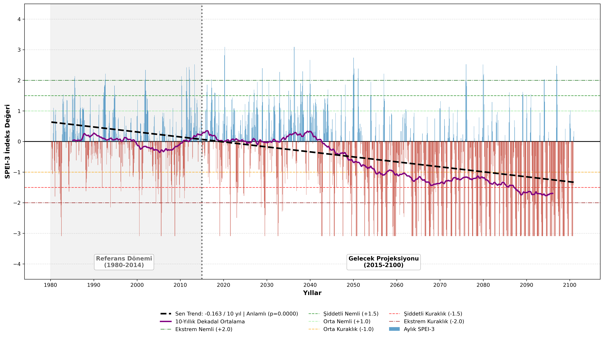
*Şekil 2: Engiz Çayı Havzası SSP5-8.5 senaryosu SPEI-3 Mann-Kendall trend analizi. Siyah kesik çizgi otokorelasyon düzeltmeli trendi, mor çizgi ise 10-yıllık dekadal salınımı göstermektedir.*

Diğer senaryolara ait trend grafikleri aşağıdadır:

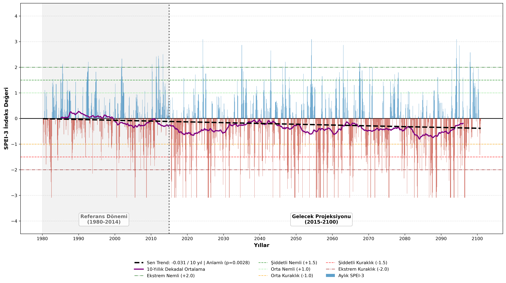
*Şekil 3: Engiz Çayı Havzası SSP1-2.6 senaryosu SPEI-3 Mann-Kendall trend analizi.*

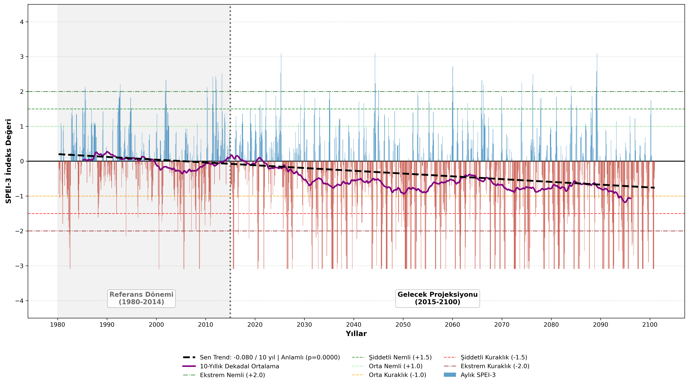
*Şekil 4: Engiz Çayı Havzası SSP2-4.5 senaryosu SPEI-3 Mann-Kendall trend analizi.*

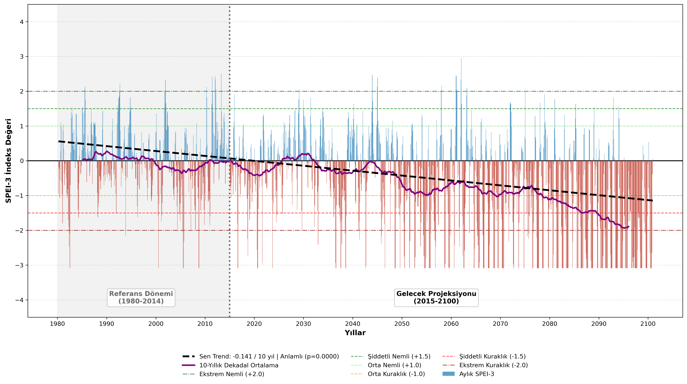
*Şekil 5: Engiz Çayı Havzası SSP3-7.0 senaryosu SPEI-3 Mann-Kendall trend analizi.*

### 4.2. Su Yılı Rejim Kayması (Pettitt Testi)

Pettitt analizi, kuraklaşmanın kademeli değil, belirli eşik yıllarında aniden hızlanan bir "rejim kayması" (regime shift) biçiminde gerçekleşeceğini göstermektedir.

  * **Ekstrem Kırılma (SSP5-8.5):** En şiddetli rejim kayması **2052 su yılında** ($p < 0.0001$) gerçekleşmektedir. Kırılma öncesi rejim ortalaması $\mu_1 = -0.01$ (normal) iken, kırılma sonrası rejim ortalaması $\mu_2 = -1.33$ (şiddetli kuraklığa yakın) değerine düşmektedir.
  * **Erken Kırılma (SSP2-4.5):** Orta emisyon senaryosunda kırılma daha erken (2031) gerçekleşmekte ancak rejim ortalaması $\mu_2 = -0.74$ seviyesinde stabilize olmaktadır.

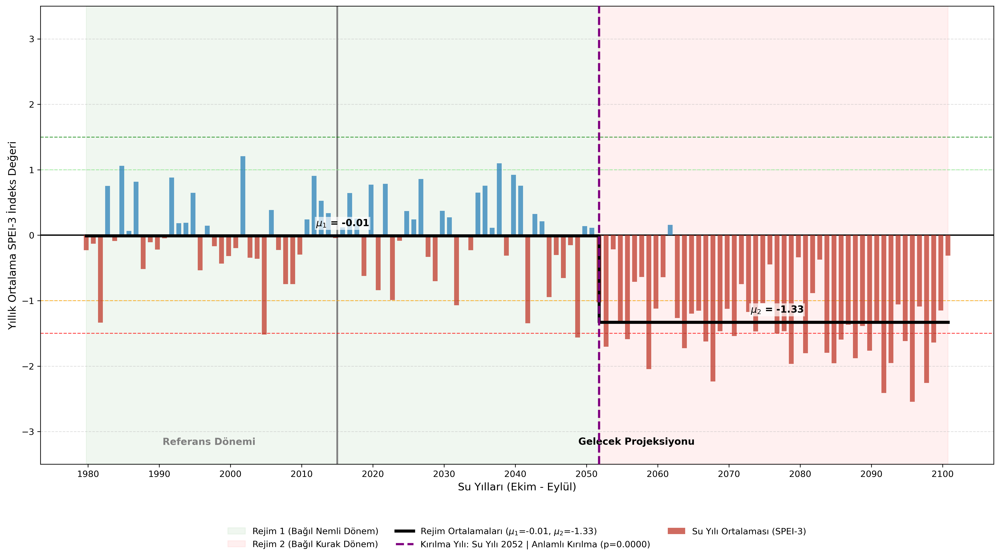
*Şekil 6: SSP5-8.5 senaryosunda 2052 su yılı itibarıyla gerçekleşen ani rejim kayması.*

Karşılaştırmalı diğer rejim kaymaları:

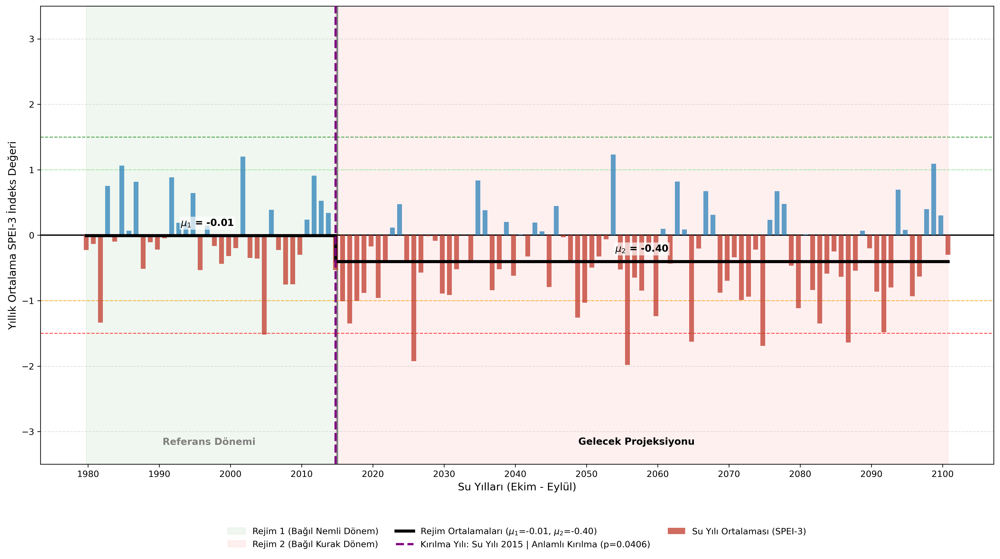
*Şekil 7: SSP1-2.6 senaryosu Pettitt kırılma analizi.*

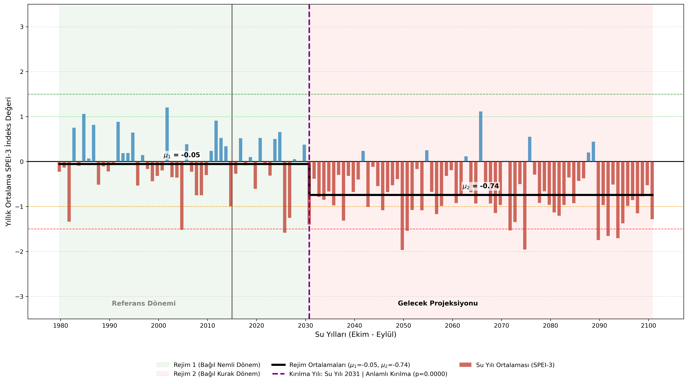
*Şekil 8: SSP2-4.5 senaryosu Pettitt kırılma analizi.*

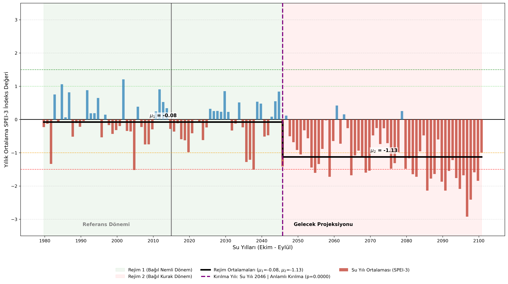
*Şekil 9: SSP3-7.0 senaryosu Pettitt kırılma analizi.*

### 4.3. Fiziksel Sürücülerin Analizi (Nedensellik)

Kuraklaşmanın arkasındaki asıl sürücüyü bulmak için Orta Gelecek (2041-2070) ve Uzak Gelecek (2071-2100) klimatolojik aylık ortalamalar, referans dönemiyle (1980-2014) karşılaştırılmıştır.

**Orta Gelecek (2041-2070):**
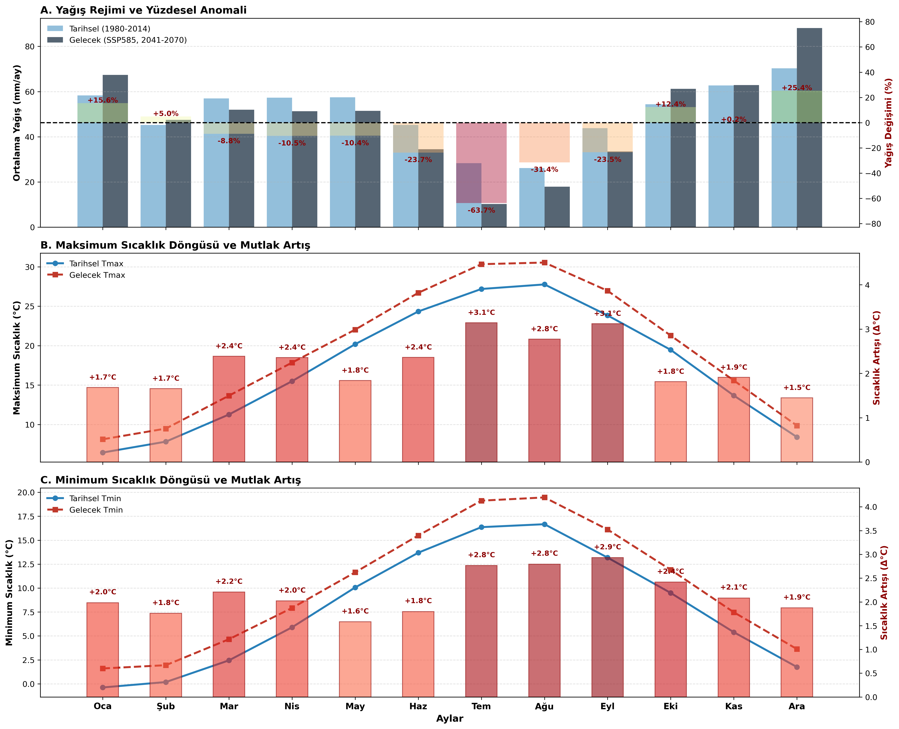
*Şekil 10: SSP5-8.5 Orta Gelecek periyodu. Yağış anomalileri asimetrik, ancak sıcaklıklarda tüm yıl boyunca mutlak artışlar (+3.5°C'ye varan) başlamış durumda.*

**Uzak Gelecek (2071-2100):**
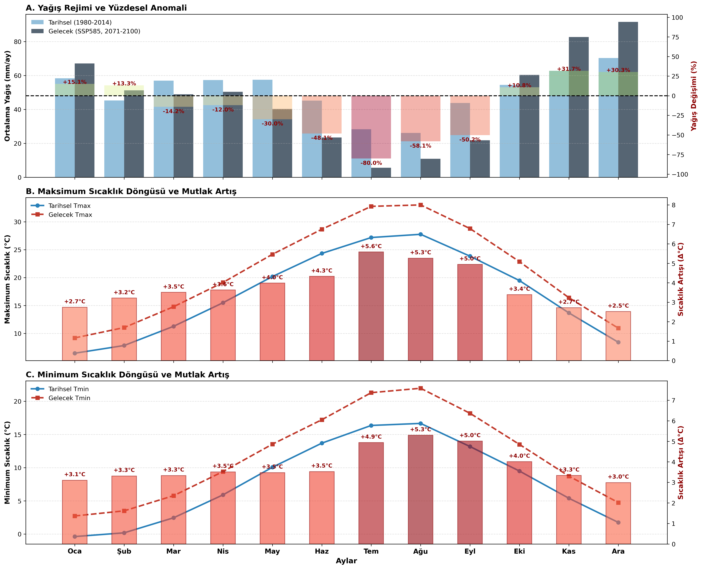
*Şekil 11: SSP5-8.5 Uzak Gelecek periyodu. Yaz aylarında %40'ı aşan yağış kayıpları ve +5.3°C'ye ulaşan $T_{max}$ ekstrem artışları.*

**Sürücü Analizinin Sentezi:** Diğer senaryoların Orta ve Uzak Gelecek grafiklerinde de görüldüğü üzere (aşağıda listelenmiştir), kış aylarında yağışlarda marjinal artışlar olmasına rağmen yaz yağışlarının %40 oranında azaldığı görülmektedir. Artan sıcaklıklar (özellikle $T_{min}$'deki gece soğumamasının getirdiği stres), potansiyel buharlaşmayı katlayarak toprak nemi açığını artırmaktadır.

*Düşük ve Orta Emisyon Senaryoları (Referans Karşılaştırmalar):*

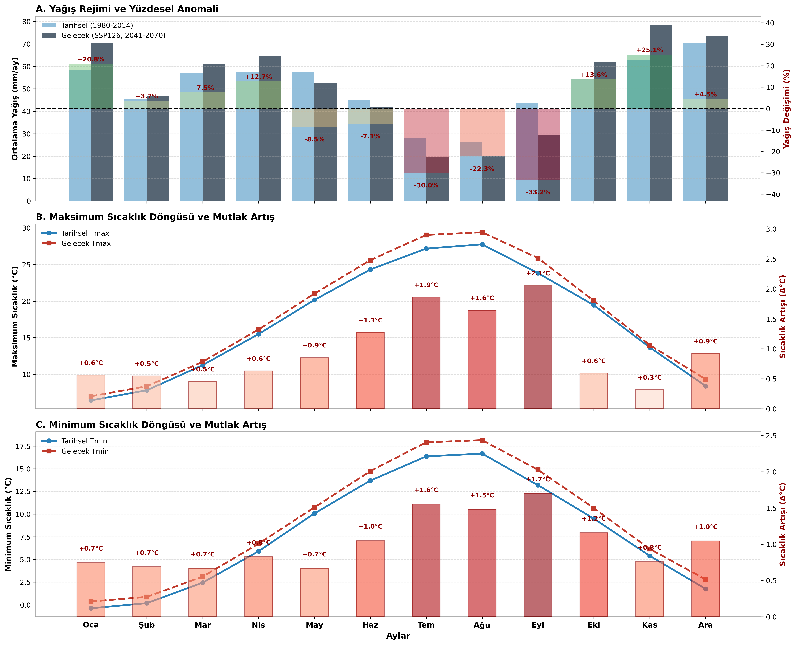
*Şekil 12: SSP1-2.6 Orta Gelecek periyodu sürücü analizi.*

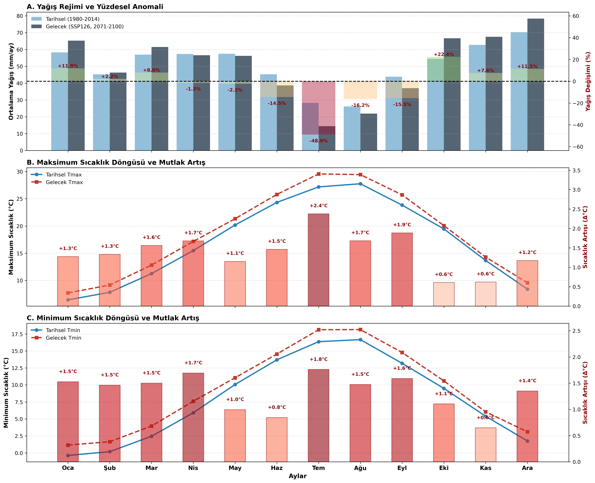
*Şekil 13: SSP1-2.6 Uzak Gelecek periyodu sürücü analizi.*

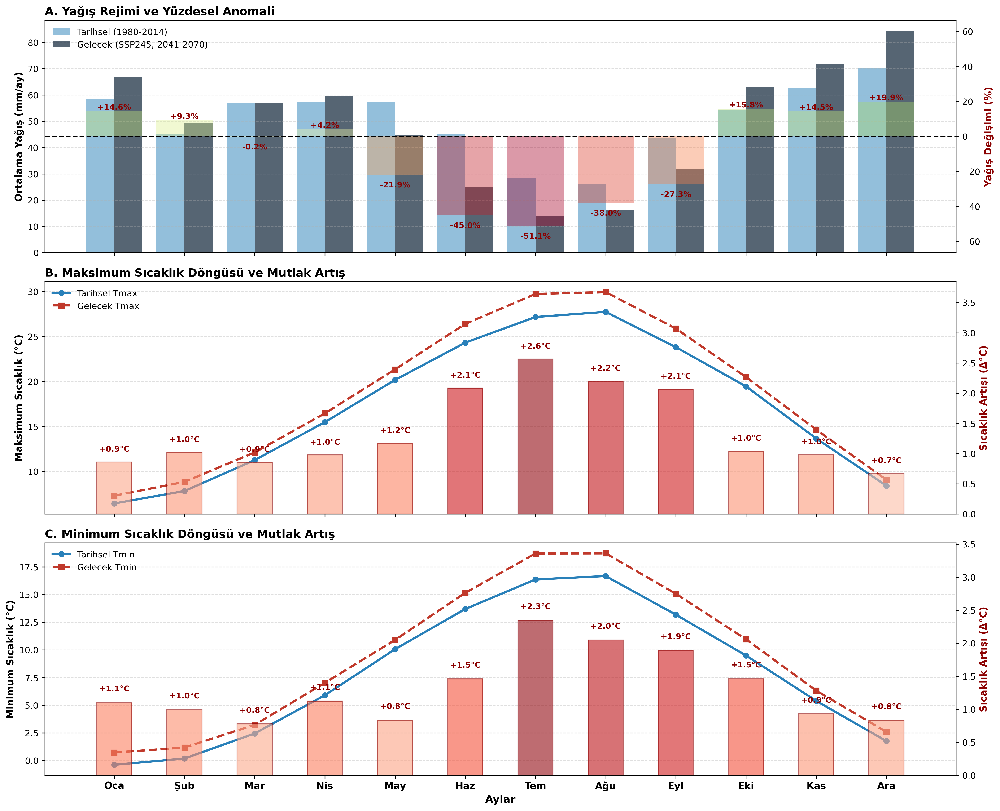
*Şekil 14: SSP2-4.5 Orta Gelecek periyodu sürücü analizi.*

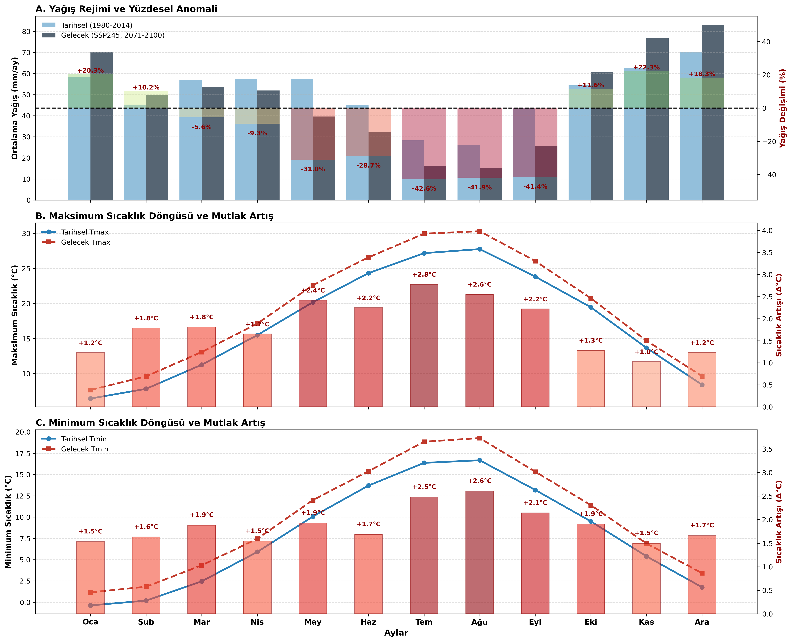
*Şekil 15: SSP2-4.5 Uzak Gelecek periyodu sürücü analizi.*

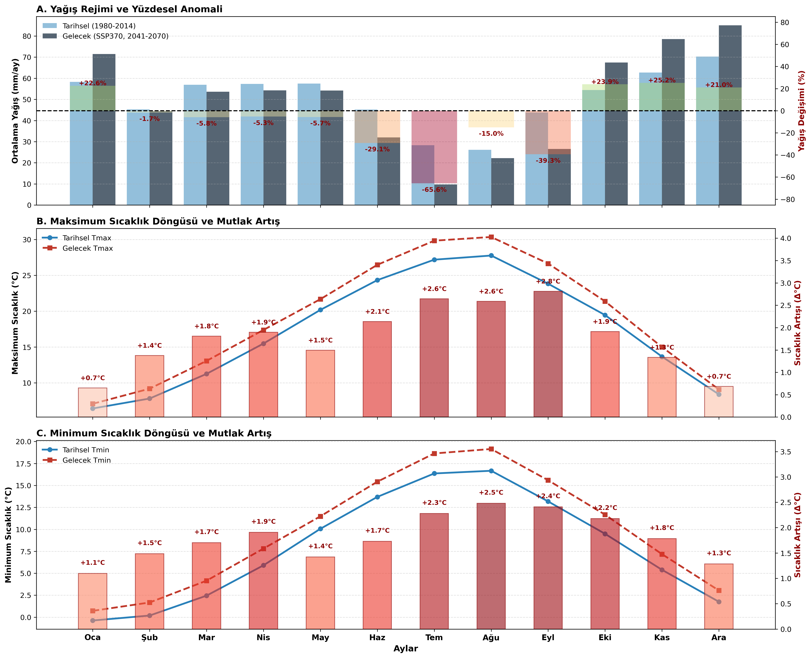
*Şekil 16: SSP3-7.0 Orta Gelecek periyodu sürücü analizi.*

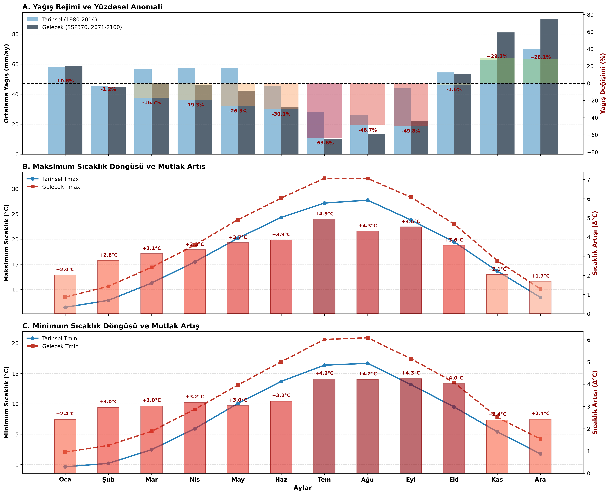
*Şekil 17: SSP3-7.0 Uzak Gelecek periyodu sürücü analizi.*

## 5\. Sonuç ve Öneriler

Yapılan hidroklimatolojik analizler, Karadeniz Bölgesi'nin tipik "nemli" karakteristiğine sahip olan Engiz Çayı Havzası'nın, 21. yüzyılın ortalarından itibaren bu özelliğini kaybederek kalıcı bir kuraklık rejimine gireceğini göstermektedir.

  * Havzadaki tarımsal faaliyetler, statik tarihsel verilere (1980-2014) göre değil, Pettitt testinde tespit edilen 2030-2050 arası kırılma yıllarındaki **"yeni normal"** su bütçesine göre acilen planlanmalıdır.
  * Artan evapotranspirasyon talebini dengelemek adına, açık yüzeyli sulama kanallarından kapalı basınçlı sistemlere geçilmesi ve kuraklığa toleranslı ürün desenlerinin teşvik edilmesi bir tercih değil, rasyonel bir zorunluluktur.
  * Karadeniz iklimine özgü, yüksek su tüketen (yaz yağışlarına güvenen) ürün desenleri terk edilerek, fizyolojik olarak kuraklığa toleranslı alternatiflere yönelim teşvik edilmelidir.

## Kaynakça

  * Hamed, K. H., & Rao, A. R. (1998). A modified Mann-Kendall trend test for autocorrelated data. *Journal of hydrology*, 204(1-4), 182-196.
  * Pettitt, A. N. (1979). A non‐parametric test for the change‐point problem. *Journal of the Royal Statistical Society: Series C (Applied Statistics)*, 28(2), 126-135.
  * Thrasher, B., vd. (2022). NASA Global Daily Downscaled Projections (NEX-GDDP-CMIP6). *Scientific Data*, 9(1), 1-8.
  * Vicente-Serrano, S. M., vd. (2010). A multiscalar standardized precipitation index sensitive to global warming: the standardized precipitation evapotranspiration index. *Journal of climate*, 23(7), 1696-1718.
